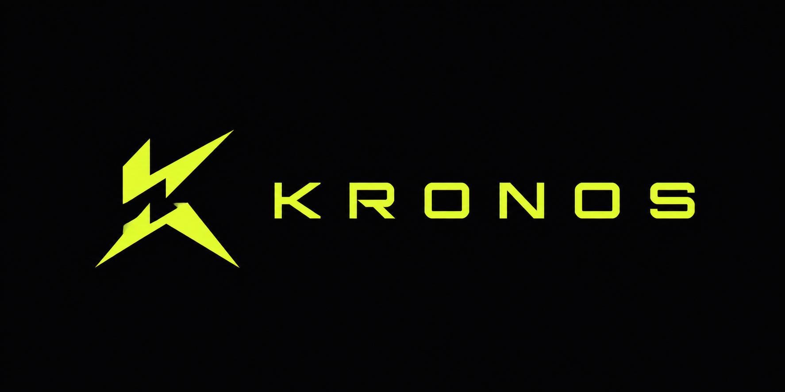

<p align="center">
  
</p>

<h1 align="center">KRONOS</h1>
<p align="center"><em>Every Metric. Every Moment.</em></p>

---

## Overview

KRONOS is a high-performance real-time analytics dashboard that visualizes live-streaming system telemetry. Built to simulate a production-grade DevOps monitoring platform with smooth animations, interactive charts, and a resilient data architecture.

---

## Setup

```bash
pnpm install
pnpm dev
```

---

## Project Structure

```
src/
├── workers/           # Web Worker — off-main-thread data streaming
├── stores/            # Pinia stores — centralized state
│   ├── metricsStore   # Circular buffer of MetricPoint data
│   ├── activityStore  # Capped event feed with filters
│   └── dashboardStore # UI state — status, sidebar, errors
├── composables/
│   └── useStreamWorker.ts  # Bridges Worker ↔ Pinia with reconnect logic
├── components/
│   ├── charts/        # MetricCard, LineChart, AreaChart, BarChart
│   ├── feed/          # ActivityFeed with TransitionGroup animations
│   └── ui/            # KBadge, KStatusDot, StreamStatusBanner, KLoadingPulse
├── layouts/           # KSidebar, KTopbar
├── types/             # TypeScript interfaces — single source of truth
└── utils/             # randomWalk, event generator, formatters, validators
```

---

## Architecture

The app is split into three clear layers:

### Data Layer
A Web Worker (`dataStream.worker.ts`) generates mock telemetry off the main thread every 1000ms using a **random walk algorithm** — each metric nudges slightly from its previous value, producing realistic wave motion rather than chaotic random spikes. It posts typed `StreamPayload` messages to the main thread. The main thread never blocks.

### State Layer
Three Pinia stores receive and hold data:
- `metricsStore` — circular buffer capped at 3600 points (1h of data at 1 tick/s). Computed `visiblePoints` slices the buffer to the selected time range.
- `activityStore` — prepends new events, capped at 200. Computed `filteredEvents` reacts to search query, severity filter, and category filter.
- `dashboardStore` — stream status, sidebar open state, error messages.

Stores are the single source of truth. Components only read via computed refs; mutations go through store actions.

### View Layer
Vue 3 components with `<script setup>` and the Composition API. Reactivity is fine-grained — only DOM nodes that depend on changed state re-render. ECharts manages its own canvas rendering independently of Vue's reactivity system, receiving data updates via computed option objects.

---

## State Management Strategy

**Pinia** was chosen over Vuex for its flat, composable API and native TypeScript support. Each store uses the Composition API style (`defineStore` with `ref` and `computed`) which maps directly to how components are written — no mental context switching between options API and composition API.

The `useStreamWorker` composable owns the Worker lifecycle and acts as the bridge between the Worker thread and the stores. It is the only place that calls `worker.postMessage()` or handles `worker.onmessage`.

---

## Rendering Optimization

| Technique | Where | Why |
|---|---|---|
| Web Worker | `dataStream.worker.ts` | Keeps data generation off the main thread |
| Circular buffer | `metricsStore` | Memory never grows beyond 3600 points |
| `animationDuration: 0` | ECharts series | Instant data updates without chart re-mount |
| `computed()` slicing | `visiblePoints` | Only renders points in selected time range |
| `TransitionGroup` | ActivityFeed rows | Native Vue list animation, no library needed |
| GSAP stagger | Entrance animations | GPU-accelerated, JS thread only on mount |
| `v-if="!latest"` guard | App.vue | Prevents chart mount before data arrives |
| Event cap (200) | `activityStore` | Feed never causes unbounded memory growth |
| Scoped styles | All components | No global CSS leakage or specificity fights |

---

## Data Streaming Approach

**Mocked streaming generator via Web Worker + setInterval.**

Each tick evolves six metrics using `randomWalk(current, min, max, step)`:
- CPU: 0–100%, step ±8
- Memory: 20–95%, step ±3
- Network: 0–1000 MB/s, step ±80
- Requests: 100–2000 req/s, step ±120
- Error Rate: 0–25%, step ±2
- Latency: 5–500ms, step ±30

0–2 activity events are randomly generated per tick from a pool of categorized message templates across 5 categories: security, performance, deployment, network, system.

---

## Error Handling & Resilience

- Worker errors are caught inside the tick function and posted as typed `WorkerError` payloads
- `useStreamWorker` implements **exponential backoff** reconnection: 1s → 2s → 4s → 8s → 16s → 30s cap
- Max 5 retry attempts before surfacing a manual retry button
- `StreamStatusBanner` animates in when status is `reconnecting` or `error`
- `KLoadingPulse` shimmer shows until the first data tick arrives
- All incoming data is typed via Zod-compatible TypeScript interfaces — malformed payloads never reach the UI

---

## Tech Stack

| Tool | Role |
|---|---|
| Vue 3 + TypeScript | Framework |
| Vite | Build tool |
| Pinia | State management |
| Apache ECharts + vue-echarts | Charts |
| GSAP | Entrance animations |
| @vueuse/motion | Component transitions |
| @vueuse/core | Composable utilities |
| Lucide Vue Next | Icons |
| Tailwind CSS v4 | Layout & utilities |
| date-fns | Timestamp formatting |
| Zod | Data validation |

---

## Trade-offs

**Mock streaming over real WebSockets** — A real WebSocket server would require a backend. The Worker approach simulates identical behavior from the frontend's perspective while keeping the project self-contained and deployable as a static site.

**ECharts over Recharts** — ECharts handles high-frequency canvas updates without re-mounting. Recharts re-renders the entire SVG tree on each data change, causing visible flicker at 1 tick/second.

**Manual virtualization over react-virtual** — The activity feed uses a simple `visibleCount` increment ("load more") rather than a full virtual scroller. This is sufficient for 200-item feeds and avoids the complexity of a virtual scroll library in a list with variable-height rows.

**Circular buffer over stream truncation** — Keeping a 3600-point hard cap (1h) means users can switch time ranges without data loss. Truncating to the visible range on each tick would lose historical data the user might switch back to.
  